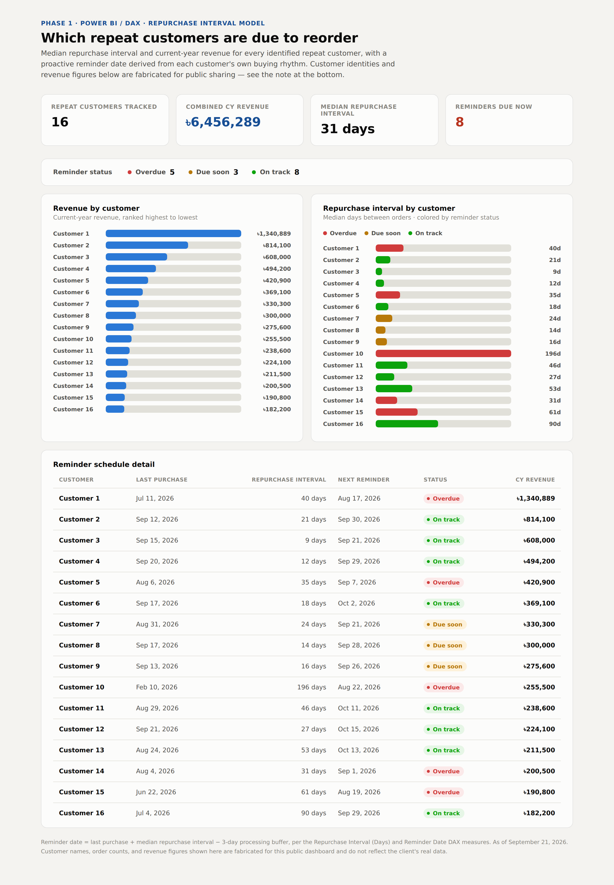

# Repurchase Prediction & Customer Retention Analysis - PowerBI
`Power BI` `DAX` `Power Query (M)` `Excel`


## Problem

The client had no systematic way to know when a repeat customer was due to reorder. Order tracking depended on manual review of large order dataset, so lapsing high-value accounts could go unnoticed.

## Data & Sources

Extracted raw order-level CSV export from WooCommerce database hosted on WordPress. The database contains Jan '25–Aug '26 order data, date, order #, invoice no., revenue, net sales, customer name, a multi-product field (up to 14 products per order, delimited), coupons, source, and attribution.

## Data Quality

Profiling the raw order export surfaced six data-quality issues, documented in full in data-quality-issues.md. Four are corrected in the transformation pipeline:

- Revenue stored as currency-formatted text — stripped and converted to a real number
- Revenue field disagreeing with the net-sales field — one is picked as canonical and used consistently
- Internal/operational accounts mixed into the customer list — filtered out via a maintained exclude-list
- Blank product fields on orders that clearly have items — flagged and kept, rather than silently dropped
- Inconsistently formatted Attribution values — not needed for this analysis, so no cleanup step was built for it
- Customer base skewed toward one-time buyers — not a data defect, just a framing note: the repurchase-interval results describe the repeat-purchase segment, not the average customer

## Data Transformation (Power Query)

Before any analysis runs, the raw order export goes through a Power Query pipeline built specifically to handle what that export gets wrong:

- Revenue stored as currency-formatted text — stripped and converted to a real number
- Revenue field disagreeing with its own "net sales" figure — one is picked as canonical, documented, and used consistently
- Internal/staff accounts mixed into the customer list — filtered out via a maintained exclude-list
- Blank product fields on orders that clearly have items — flagged and preserved instead of silently dropped
- Inconsistently formatted marketing-channel values — standardized into a clean set of categories

That's five out of six data-quality issues found in the export, resolved directly in the pipeline. The sixth — the customer base skewing toward one-time buyers isn't a data error, so it's handled as a scoping note at the reporting layer instead.

Full breakdown with the actual M code: phase-1-bi-repurchase-model/data-transformation.md

## Data Modeling (DAX)

**Calculated column — Previous Purchase Date** (per-customer self-lookup):

```DAX
VAR CurrentCustomer = 'Customer Order'[Customer]
VAR CurrentDate = 'Customer Order'[Purchase Date]
RETURN
CALCULATE(
    MAX('Customer Order'[Purchase Date]),
    FILTER(ALL('Customer Order'), 'Customer Order'[Customer] = CurrentCustomer && 'Customer Order'[Purchase Date] < CurrentDate)
)
```

**Calculated column — Repurchase Interval:**

```DAX
VAR CurrentPurchaseDate = 'Customer Order'[Purchase Date]
VAR PreviousPurchaseDate = 'Customer Order'[Previous Purchase Date]
RETURN
IF(ISBLANK(PreviousPurchaseDate), BLANK(), DATEDIFF(PreviousPurchaseDate, CurrentPurchaseDate, DAY))
```

**Measure — Repurchase Interval (Days):**

```DAX
MEDIANX(
    FILTER('Customer Order', NOT ISBLANK('Customer Order'[Repurchase Interval])),
    'Customer Order'[Repurchase Interval]
)
```

Uses **median**, not average — a single unusually long gap (a customer who churned and returned once) would otherwise distort that customer's reminder timing.

**Measure — Total Revenue 2026:**

```DAX
CALCULATE(SUM(Orders[Revenue]), Orders[Year] = "2026")
```

## Findings



- 16 repeat customers identified with documented repurchase patterns (intervals from 9 to 196 days), representing ৳6,456,289 in combined 2026 revenue.
- Built a proactive reminder schedule (Sep–Dec 2026): `Reminder Date = Last Purchase + Repurchase Interval − 3-day processing buffer`.
- Identified the top 10 new high-value accounts by 2026 revenue with no repeat purchase yet, flagged for retention outreach.

## Recommendations

- Automate the reminder schedule into a recurring trigger rather than a one-off manual run.
- Prioritize the two highest-frequency buyers (9–12 day intervals) first — they generate the most reminder touchpoints per quarter.
- Track actual reorder conversion from reminders sent, to replace the interval estimate with a real response-rate model over time.

## Assumptions & Limitations

- The median-interval estimate assumes fairly regular buying behavior; it will be less reliable for a customer who returns after an unusually long gap (e.g. the 196-day case). The model currently relies on Power BI's auto-generated date tables rather than a single shared, explicitly marked Date dimension — a cleanup item for the next iteration.

- Data Quality Issue 7 — the customer base skewing toward one-time buyers — isn't a transformation problem, so there's no step for it here. It's handled at the reporting layer: the repurchase-interval model scopes explicitly to the repeat-purchase segment rather than treating the full customer list as representative.)

## Privacy note

Client name, customer names, and exact revenue figures are anonymized or replaced with illustrative sample data throughout this project's public files. The underlying `.pbix` and raw Excel exports contain real customer data and are intentionally **not** included in this repository.

